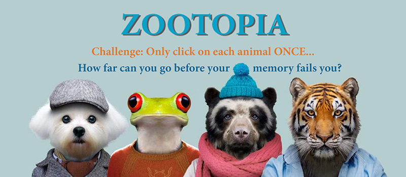

# Zootopia Memory Game

Click on each zoo card only once! 

Be careful... the cards will shuffle after each click!

How many unique clicks can you successfully make before your memory fails you?!

## Giphy Demo

## GO TO SITE

* [Zootopia](https://jenkruk.github.io/zootopia/)

## Built With

* [HTML](https://developer.mozilla.org/en-US/docs/Web/HTML)
* [CSS](https://developer.mozilla.org/en-US/docs/Web/CSS)
* [Javascript](https://developer.mozilla.org/en-US/docs/Web/JavaScript)
* [jQuery](https://developer.mozilla.org/en-US/docs/Glossary/jQuery)
* [React](https://developer.mozilla.org/en-US/docs/Learn/Tools_and_testing/Client-side_JavaScript_frameworks/React_getting_started)
* [Bootstrap](https://getbootstrap.com/)
* [JSX](https://reactjs.org/docs/introducing-jsx.html)
* [ES6](https://developer.mozilla.org/en-US/docs/Archive/Web/JavaScript/New_in_JavaScript/ECMAScript_2015_support_in_Mozilla)
* [Nodejs](https://nodejs.org/en/about/)
* [uifx](https://www.npmjs.com/package/uifx)

## This project was created by:
* *Jennifer Kruk* - [github](https://github.com/jenkruk)

## License

This project is licensed under the MIT License
